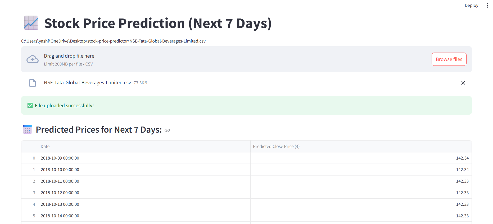
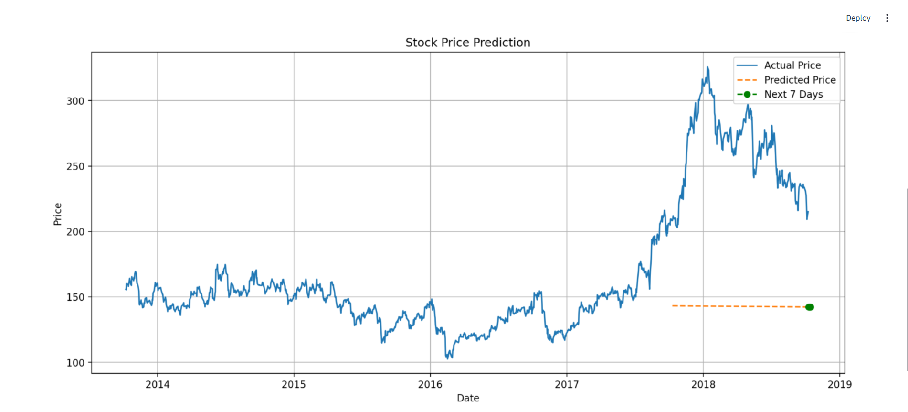

# 📈 Stock Price Predictor using Streamlit

A simple and interactive web application built with **Streamlit** that predicts the **next 7 days** of stock prices using a machine learning model trained on historical data. No TensorFlow or deep learning used — just clean preprocessing and classical ML.

---

## 🚀 Features

- 📤 Upload CSV file of historical stock data
- 📅 Predicts next 7 days' closing prices
- 📊 Displays predicted prices in a table
- ✅ Easy to run locally
- 💡 Lightweight — no need for GPU

---

## 🖼️ App Screenshots

### 📌 Uploading a File and Getting Prediction



### 📌 Displaying Forecast Table



---

## 📂 Dataset Format

Make sure your CSV file contains at least the following columns:

```csv
Date, Open, High, Low, Last, Close, Total Trade Quantity, Turnover (Lacs)
